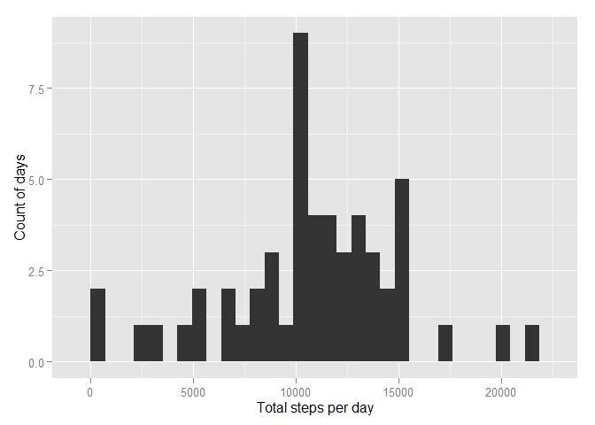
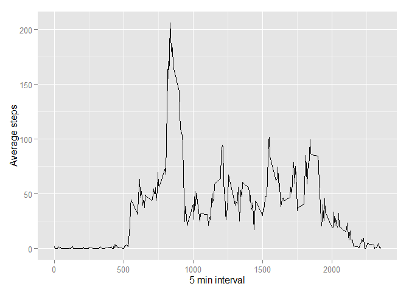
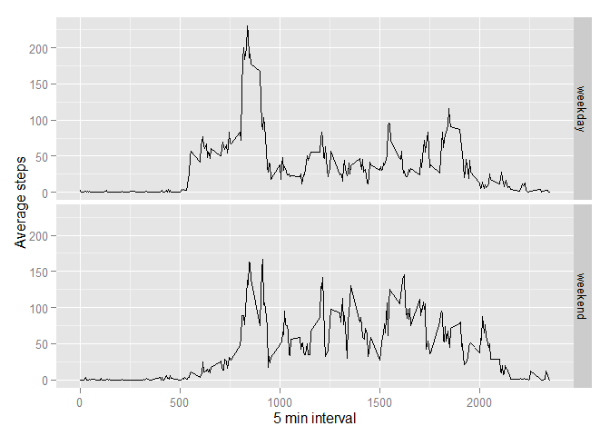

# Reproducible Research: Peer Assessment 1
## Preliminaries
Check an load necessary packages.   

```r
# check to see if required packages are installed, then load them all
check_packages <- function(packagelist) {
    # make a vector of packages whose names are not in the installed packages
    new.packages <- packagelist[!(packagelist %in% installed.packages()[,"Package"])]
    # if there is any length to this list, install those packages
    if(length(new.packages)) {install.packages(new.packages)}
    # now load the packages one by one - my contribution!
    for(x in packagelist) {
        library(x, character.only = TRUE)
    }
}

check_packages(c("dplyr","ggplot2","grid"))
```


## Loading and preprocessing the data
1. load the data and read the date in as class Date. no fancy stuff necessary as it's in %Y-%m-%d format.  

```r
activity <- read.csv(file = "activity.csv", colClasses = c("integer", "Date", "integer"))
```

2. no processing obviously needed after date conversion. But run a few basic summaries. Note that steps contains 2304 NAs out of 17568 observations.  

```r
str(activity)
```

```
## 'data.frame':	17568 obs. of  3 variables:
##  $ steps   : int  NA NA NA NA NA NA NA NA NA NA ...
##  $ date    : Date, format: "2012-10-01" "2012-10-01" ...
##  $ interval: int  0 5 10 15 20 25 30 35 40 45 ...
```

```r
summary(activity)
```

```
##      steps             date               interval     
##  Min.   :  0.00   Min.   :2012-10-01   Min.   :   0.0  
##  1st Qu.:  0.00   1st Qu.:2012-10-16   1st Qu.: 588.8  
##  Median :  0.00   Median :2012-10-31   Median :1177.5  
##  Mean   : 37.38   Mean   :2012-10-31   Mean   :1177.5  
##  3rd Qu.: 12.00   3rd Qu.:2012-11-15   3rd Qu.:1766.2  
##  Max.   :806.00   Max.   :2012-11-30   Max.   :2355.0  
##  NA's   :2304
```

```r
# 
```

## What is the mean total number of steps taken per day?  
1. make a histogram of the total number of steps taken each day  

```r
# uses dplyr to summarize total steps by day
by_day <- group_by(activity, date)
steps_by_day <- summarize(by_day,
    steps = sum(steps))

ggplot(steps_by_day, aes(x = steps)) + geom_histogram() + xlab("Total steps per day") + ylab("Count of days")
```

```
## stat_bin: binwidth defaulted to range/30. Use 'binwidth = x' to adjust this.
```

 

2. Calculate and report the mean and median total number of steps taken per day  

```r
mean(steps_by_day$steps, na.rm = TRUE)
```

```
## [1] 10766.19
```

```r
median(steps_by_day$steps, na.rm = TRUE)
```

```
## [1] 10765
```


## What is the average daily activity pattern?  
1. Make a time series plot (i.e. type = "l") of the 5-minute interval (x-axis) and the average number of steps taken, averaged across all days (y-axis)  

```r
# summarize using dplyr again
by_interval <- group_by(activity, interval)
steps_by_interval <- summarize(by_interval,
    steps = mean(steps, na.rm=TRUE))

ggplot(steps_by_interval, aes(y = steps, x = interval)) + geom_line() + xlab("5 min interval") + ylab("Average steps")
```

 

2. Which 5-minute interval, on average across all the days in the dataset, contains the maximum number of steps?  

```r
filter(steps_by_interval, steps == max(steps))
```

```
## Source: local data frame [1 x 2]
## 
##   interval    steps
## 1      835 206.1698
```

```r
# the 835 interval has the max average steps
```

## Imputing missing values  
1. Calculate and report the total number of missing values in the dataset (i.e. the total number of rows with NAs)  

```r
# this is already provided in the summary, but here it is a seperate thing
sum(is.na(activity$steps))
```

```
## [1] 2304
```

```r
# another way
sum(!complete.cases(activity))
```

```
## [1] 2304
```

2 + 3. fill in missing values - with the mean for the average for the 5 min interval  

```r
# use dplyr's grouped operations to group by time interval combined with mutate to create a new variable where all the missing values are replaced by the group (i.e. time interval) mean
activity2 <- mutate(by_interval, # by_interal was made in an early code chunk
    steps_no_na = ifelse(is.na(steps), mean(steps, na.rm=TRUE), steps)
    )
# no more NAs
sum(is.na(activity2$steps_no_na))
```

```
## [1] 0
```

```r
# let's drop the steps with NA's and rename steps_no_na to steps to make things easier moving forward
activity2$steps <- NULL
activity2 <- rename(activity2, steps = steps_no_na)
sum(is.na(activity2$steps))
```

```
## [1] 0
```

4. Make a histogram of the total number of steps taken each day and Calculate and report the mean and median total number of steps taken per day. Do these values differ from the estimates from the first part of the assignment? What is the impact of imputing missing data on the estimates of the total daily number of steps?  

```r
by_day_nona <- group_by(activity2, date)
steps_by_day_nona <- summarize(by_day_nona,
    steps = sum(steps))

ggplot(steps_by_day_nona, aes(x = steps)) + geom_histogram() + xlab("Total steps per day") + ylab("Count of days")
```

```
## stat_bin: binwidth defaulted to range/30. Use 'binwidth = x' to adjust this.
```

 

mean and median stems per day   

```r
mean(steps_by_day_nona$steps, na.rm = TRUE)
```

```
## [1] 10766.19
```

```r
median(steps_by_day_nona$steps, na.rm = TRUE)
```

```
## [1] 10766.19
```
The method of filling in the missing values with the mean at the time interval doesn't impact the average daily estimates all that much - because I'm filling in with means. In the histogram you can see that there are increases in the number of days with a particular count, so the total daily steps increases on those days that had a lot of NAs, but the average does not shift.  

## Are there differences in activity patterns between weekdays and weekends?  
1. Using the dataset with the filled-in missing values, create a new factor variable in the dataset with two levels -- "weekday" and "weekend" indicating whether a given date is a weekday or weekend day.  

```r
activity2$weekday <- weekdays(activity2$date)
activity2$weekend <- as.factor(ifelse(activity2$weekday == "Saturday" | activity2$weekday == "Sunday", "weekend", "weekday"))
```

2. Make a panel plot containing a time series plot (i.e. type = "l") of the 5-minute interval (x-axis) and the average number of steps taken, averaged across all weekday days or weekend days (y-axis).  

```r
# summarize using dplyr again
by_interval2 <- group_by(activity2, interval, weekend)
steps_by_interval2 <- summarize(by_interval2,
    steps = mean(steps, na.rm=TRUE))

ggplot(steps_by_interval2, aes(y = steps, x = interval)) + geom_line() + xlab("5 min interval") + ylab("Average steps") + facet_grid(weekend ~ .)
```

 
